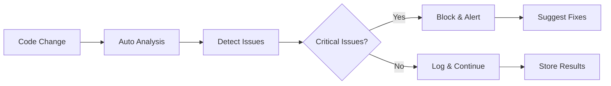
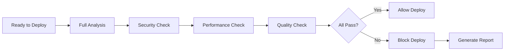

# 🔍 Auto Analysis

Auto Analysis is AiBuild's intelligent code analysis system that continuously monitors, analyzes, and provides insights about your AI-generated code to ensure quality, security, and best practices.

## Overview

Auto Analysis provides comprehensive code analysis capabilities:

- **Logic flow detection** - Identify control flow issues and edge cases
- **Code quality analysis** - Detect code smells and anti-patterns
- **Security analysis** - Find vulnerabilities and security issues
- **Performance analysis** - Identify bottlenecks and optimization opportunities
- **Best practices** - Ensure code follows established conventions
- **Dependency analysis** - Check for outdated or vulnerable dependencies

## Features

### 1. Logic Flow Detection

Automatically detect potential issues in code logic and control flow.

#### Issue Types Detected

```typescript
type LogicFlowIssueKind =
  | "missing-check"      // Missing null/undefined checks
  | "unsafe-call"        // Potentially unsafe operations
  | "dead-code"          // Unreachable code
  | "unhandled-error"    // Missing error handling
  | "infinite-loop"      // Potential infinite loops
  | "race-condition"     // Async race conditions
  | "memory-leak"        // Potential memory leaks

interface LogicFlowIssue {
  kind: LogicFlowIssueKind
  path: string
  line: number
  column: number
  message: string
  suggestion?: string
  severity: "error" | "warning" | "info"
  autoFixable: boolean
}
```

#### How It Works

```typescript
async function detectLogicFlows(projectId: string) {
  const files = await fileService.getAllFiles(projectId)
  const issues: LogicFlowIssue[] = []
  
  for (const file of files) {
    // 1. Parse code into AST
    const ast = await parser.parse(file.content, {
      language: file.language,
    })
    
    // 2. Analyze control flow
    const flowAnalysis = await analyzeControlFlow(ast)
    
    // 3. Detect missing checks
    const missingChecks = detectMissingChecks(flowAnalysis)
    issues.push(...missingChecks)
    
    // 4. Detect unsafe operations
    const unsafeCalls = detectUnsafeCalls(flowAnalysis)
    issues.push(...unsafeCalls)
    
    // 5. Detect dead code
    const deadCode = detectDeadCode(flowAnalysis)
    issues.push(...deadCode)
    
    // 6. Detect unhandled errors
    const unhandledErrors = detectUnhandledErrors(flowAnalysis)
    issues.push(...unhandledErrors)
  }
  
  // 7. Store analysis results
  await analysisService.store({
    projectId,
    kind: 'logic-flow',
    issues,
    timestamp: new Date(),
  })
  
  // 8. Log analysis
  await traceLogger.log({
    kind: 'analysis',
    status: issues.some(i => i.severity === 'error') ? 'error' : 'ok',
    metadata: {
      totalIssues: issues.length,
      errors: issues.filter(i => i.severity === 'error').length,
      warnings: issues.filter(i => i.severity === 'warning').length,
    },
  })
  
  return issues
}
```

#### Example Detections

**Missing Null Check:**
```typescript
// Detected issue
function getUserName(user) {
  return user.name.toUpperCase()  // ❌ Missing null check
}

// Suggestion
function getUserName(user) {
  if (!user || !user.name) {
    return 'Unknown'
  }
  return user.name.toUpperCase()  // ✅ Safe
}
```

**Unhandled Error:**
```typescript
// Detected issue
async function fetchUserData(userId) {
  const response = await fetch(`/api/users/${userId}`)  // ❌ No error handling
  return response.json()
}

// Suggestion
async function fetchUserData(userId) {
  try {
    const response = await fetch(`/api/users/${userId}`)
    if (!response.ok) {
      throw new Error(`Failed to fetch user: ${response.statusText}`)
    }
    return response.json()
  } catch (error) {
    console.error('Error fetching user data:', error)
    throw error
  }
}
```

**Dead Code:**
```typescript
// Detected issue
function processOrder(order) {
  if (order.status === 'cancelled') {
    return null
  }
  
  if (order.status === 'cancelled') {  // ❌ Dead code - condition already checked
    console.log('Order cancelled')
  }
  
  return order
}
```

### 2. Code Quality Analysis

Analyze code quality and detect anti-patterns.

#### Quality Metrics

```typescript
interface CodeQualityMetrics {
  complexity: {
    cyclomatic: number        // Cyclomatic complexity
    cognitive: number         // Cognitive complexity
    halstead: number          // Halstead complexity
  }
  maintainability: {
    index: number            // Maintainability index (0-100)
    linesOfCode: number
    commentRatio: number
  }
  duplication: {
    percentage: number
    blocks: DuplicationBlock[]
  }
  smells: CodeSmell[]
}

interface CodeSmell {
  type: string
  file: string
  line: number
  description: string
  severity: "minor" | "major" | "critical"
  effort: string  // e.g., "5min", "1h"
}
```

#### Detected Code Smells

1. **Long Method** - Functions that are too long
2. **Large Class** - Classes with too many responsibilities
3. **God Object** - Objects that know/do too much
4. **Duplicate Code** - Repeated code blocks
5. **Magic Numbers** - Hard-coded values without explanation
6. **Complex Conditionals** - Nested or complex if statements
7. **Deep Nesting** - Excessive indentation levels

#### Example

```typescript
async function analyzeCodeQuality(projectId: string) {
  const files = await fileService.getCodeFiles(projectId)
  const metrics: CodeQualityMetrics[] = []
  
  for (const file of files) {
    // Calculate complexity
    const complexity = await calculateComplexity(file)
    
    // Calculate maintainability
    const maintainability = await calculateMaintainability(file)
    
    // Detect duplication
    const duplication = await detectDuplication(file, files)
    
    // Detect smells
    const smells = await detectCodeSmells(file)
    
    metrics.push({
      file: file.path,
      complexity,
      maintainability,
      duplication,
      smells,
    })
  }
  
  return metrics
}
```

### 3. Security Analysis

Identify security vulnerabilities and potential threats.

#### Security Checks

```typescript
type SecurityIssueType =
  | "xss"                    // Cross-site scripting
  | "sql-injection"          // SQL injection
  | "path-traversal"         // Path traversal
  | "command-injection"      // Command injection
  | "insecure-random"        // Weak random number generation
  | "hardcoded-secrets"      // Hardcoded credentials
  | "insecure-crypto"        // Weak cryptography
  | "unsafe-regex"           // ReDoS vulnerabilities
  | "prototype-pollution"    // Prototype pollution
  | "open-redirect"          // Open redirect

interface SecurityIssue {
  type: SecurityIssueType
  file: string
  line: number
  severity: "low" | "medium" | "high" | "critical"
  description: string
  cwe?: string              // CWE identifier
  owasp?: string            // OWASP category
  recommendation: string
}
```

#### Example Detections

**XSS Vulnerability:**
```typescript
// Detected issue
function renderHTML(userInput) {
  return `<div>${userInput}</div>`  // ❌ XSS vulnerability
}

// Recommendation
import { escapeHtml } from './utils'

function renderHTML(userInput) {
  return `<div>${escapeHtml(userInput)}</div>`  // ✅ Safe
}
```

**Hardcoded Secrets:**
```typescript
// Detected issue
const API_KEY = "sk_example_abc123..."  // ❌ Hardcoded secret

// Recommendation
const API_KEY = process.env.API_KEY  // ✅ Environment variable
```

**SQL Injection:**
```typescript
// Detected issue
function getUser(username) {
  return db.query(`SELECT * FROM users WHERE username = '${username}'`)  // ❌ SQL injection
}

// Recommendation
function getUser(username) {
  return db.query('SELECT * FROM users WHERE username = ?', [username])  // ✅ Parameterized query
}
```

### 4. Performance Analysis

Identify performance bottlenecks and optimization opportunities.

#### Performance Issues

```typescript
interface PerformanceIssue {
  type: string
  file: string
  line: number
  impact: "low" | "medium" | "high"
  description: string
  optimization: string
  estimatedGain: string
}

// Issue types
const performanceIssueTypes = [
  'n-plus-one-query',        // Database N+1 queries
  'inefficient-loop',        // Inefficient iterations
  'unnecessary-render',      // React unnecessary re-renders
  'large-bundle',            // Large JavaScript bundles
  'blocking-operation',      // Blocking main thread
  'memory-intensive',        // High memory usage
  'unoptimized-image',      // Large unoptimized images
  'missing-cache',          // Missing caching opportunities
]
```

#### Example Detections

**N+1 Query:**
```typescript
// Detected issue
async function getUsersWithPosts() {
  const users = await User.findAll()
  
  for (const user of users) {
    user.posts = await Post.findByUserId(user.id)  // ❌ N+1 query
  }
  
  return users
}

// Optimization
async function getUsersWithPosts() {
  const users = await User.findAll({
    include: [{ model: Post }]  // ✅ Single query with join
  })
  return users
}
```

**Unnecessary Re-renders:**
```typescript
// Detected issue
function UserList({ users }) {
  return users.map(user => (
    <UserCard
      key={user.id}
      user={user}
      onEdit={() => console.log(user.id)}  // ❌ New function on every render
    />
  ))
}

// Optimization
function UserList({ users }) {
  const handleEdit = useCallback((userId) => {
    console.log(userId)
  }, [])
  
  return users.map(user => (
    <UserCard
      key={user.id}
      user={user}
      onEdit={() => handleEdit(user.id)}  // ✅ Stable reference
    />
  ))
}
```

### 5. Dependency Analysis

Analyze project dependencies for issues.

```typescript
interface DependencyAnalysis {
  total: number
  outdated: OutdatedDependency[]
  vulnerable: VulnerableDependency[]
  unused: string[]
  duplicates: DuplicateDependency[]
  licenses: LicenseIssue[]
}

interface VulnerableDependency {
  name: string
  version: string
  vulnerability: {
    id: string              // CVE or advisory ID
    severity: "low" | "medium" | "high" | "critical"
    description: string
    fixedIn: string         // Version that fixes the issue
  }
}
```

### 6. Best Practices Analysis

Ensure code follows established conventions and best practices.

```typescript
interface BestPracticeViolation {
  rule: string
  file: string
  line: number
  message: string
  category: "style" | "convention" | "best-practice"
  autoFixable: boolean
}

// Example rules
const bestPracticeRules = [
  'use-const-instead-of-let',
  'prefer-arrow-functions',
  'use-async-await',
  'avoid-any-type',
  'add-type-annotations',
  'use-strict-equality',
  'avoid-console-log',
  'handle-promise-rejection',
]
```

## Analysis Workflows

### Workflow 1: Continuous Analysis



### Workflow 2: Pre-Deployment Analysis



## Analysis Configuration

```typescript
interface AnalysisConfig {
  enabled: boolean
  runOn: {
    generation: boolean
    save: boolean
    commit: boolean
    deploy: boolean
  }
  rules: {
    logicFlow: {
      enabled: boolean
      severity: "error" | "warning"
    }
    security: {
      enabled: boolean
      level: "strict" | "moderate" | "relaxed"
    }
    performance: {
      enabled: boolean
      thresholds: {
        bundleSize: number    // Max bundle size in KB
        loadTime: number      // Max load time in ms
      }
    }
    quality: {
      enabled: boolean
      minMaintainability: number
      maxComplexity: number
    }
  }
  exclude: string[]          // Files to exclude from analysis
  customRules?: CustomRule[]
}
```

## Analysis Dashboard

Real-time analysis monitoring in the workspace:

```typescript
interface AnalysisDashboard {
  overview: {
    totalIssues: number
    byCategory: Record<string, number>
    bySeverity: Record<string, number>
    trend: number[]
  }
  issues: AnalysisIssue[]
  metrics: {
    codeQuality: number
    security: number
    performance: number
    maintainability: number
  }
  recommendations: Recommendation[]
}
```

## Integration with Auto Fix

Auto Analysis works seamlessly with Auto Fix to automatically resolve detected issues.

```typescript
async function analyzeAndFix(projectId: string) {
  // 1. Run analysis
  const issues = await analyzeProject(projectId)
  
  // 2. Filter auto-fixable issues
  const fixable = issues.filter(i => i.autoFixable)
  
  // 3. Attempt auto-fix
  const fixed = await autoFix.fixIssues(projectId, fixable)
  
  // 4. Re-analyze to verify fixes
  const remaining = await analyzeProject(projectId)
  
  return {
    total: issues.length,
    fixed: fixed.length,
    remaining: remaining.length,
  }
}
```

## Analysis Reports

Generate comprehensive analysis reports:

```typescript
interface AnalysisReport {
  projectId: string
  timestamp: Date
  summary: {
    totalIssues: number
    criticalIssues: number
    securityIssues: number
    performanceIssues: number
    qualityScore: number
  }
  details: {
    logicFlow: LogicFlowIssue[]
    security: SecurityIssue[]
    performance: PerformanceIssue[]
    quality: CodeQualityMetrics
    dependencies: DependencyAnalysis
  }
  recommendations: Recommendation[]
  trends: {
    issueHistory: number[]
    qualityHistory: number[]
  }
}
```

## Best Practices

### 1. Regular Analysis

Run analysis frequently to catch issues early:

```typescript
// Enable auto-analysis on save
await projectService.updateSettings(projectId, {
  analysis: {
    enabled: true,
    runOn: {
      save: true,
      generation: true,
    },
  },
})
```

### 2. Fix Critical Issues First

Prioritize critical and high-severity issues:

```typescript
const criticalIssues = issues
  .filter(i => i.severity === 'critical' || i.severity === 'error')
  .sort((a, b) => priorityScore(b) - priorityScore(a))
```

### 3. Monitor Trends

Track analysis metrics over time:

```typescript
const trend = await analysisService.getTrend(projectId, {
  metric: 'qualityScore',
  period: '30d',
})

if (trend.direction === 'decreasing') {
  await notifyService.alert({
    type: 'quality-degradation',
    projectId,
    trend,
  })
}
```

### 4. Customize Rules

Tailor analysis rules to your project:

```typescript
await projectService.updateAnalysisConfig(projectId, {
  rules: {
    quality: {
      maxComplexity: 10,
      minMaintainability: 60,
    },
    customRules: [
      {
        name: 'no-inline-styles',
        pattern: /style={{/,
        message: 'Use CSS classes instead of inline styles',
        severity: 'warning',
      },
    ],
  },
})
```

## Troubleshooting

### Common Issues

**Analysis Takes Too Long:**
- Exclude large files or directories
- Run analysis in background
- Use incremental analysis for changes

**Too Many False Positives:**
- Adjust severity thresholds
- Configure custom rules
- Use ignore comments in code

**Missing Issues:**
- Check excluded files
- Verify analysis is enabled
- Update to latest version

## API Reference

```typescript
// Run analysis
POST /api/projects/:id/analyze
Body: {
  types?: ('logic-flow' | 'security' | 'performance' | 'quality')[]
  autoFix?: boolean
}

// Get analysis results
GET /api/projects/:id/analysis/results

// Get analysis report
GET /api/projects/:id/analysis/report

// Update analysis config
PATCH /api/projects/:id/analysis/config
Body: AnalysisConfig
```

## Learn More

- [Auto Fix Documentation](./auto-fix.md)
- [Auto Test Documentation](./auto-test.md)
- [Developer Guide - Code Quality](../guides/developer-guide.md#code-quality)
- [Security Best Practices](../guides/developer-guide.md#security)

---

**Auto Analysis ensures your AI-generated code meets the highest quality standards.**
