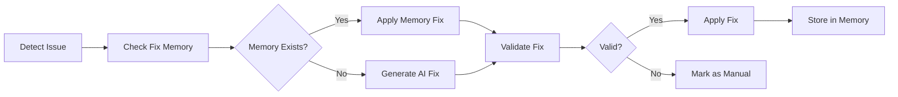

# 🔧 Auto Fix

Auto Fix is AiBuild's intelligent automatic issue resolution system that uses AI and learned patterns to automatically fix detected problems in your generated code, ensuring quality and reliability without manual intervention.

## Overview

Auto Fix provides comprehensive automatic problem resolution:

- **Fix Memory System** - Learns and remembers successful fixes
- **Pattern Recognition** - Identifies similar issues across projects
- **AI-Powered Fixes** - Uses AI to generate context-aware solutions
- **Multi-Strategy Approach** - Multiple fix strategies for reliability
- **Safe Application** - Validates fixes before applying
- **Rollback Support** - Undo changes if fixes cause issues

## Features

### 1. Fix Memory System

The Fix Memory System stores and applies known fixes for common issues.

#### How It Works

```typescript
interface FixMemory {
  id: string
  projectId: string | null      // null = global fix
  issuePattern: string          // Pattern that identifies the issue
  issueType: string             // Type of issue (e.g., 'missing-check')
  fixPattern: string            // Pattern to apply as fix
  context: {
    language: string
    framework?: string
    fileType?: string
  }
  metadata: {
    applicableFiles: string[]   // File patterns where fix applies
    successRate: number         // Success rate (0-1)
    timesApplied: number       // Number of successful applications
    lastApplied: Date
  }
  createdBy: 'ai' | 'user' | 'system'
  createdAt: Date
  updatedAt: Date
}
```

#### Creating Fix Memories

```typescript
async function createFixMemory(fix: FixMemoryInput) {
  // 1. Validate fix pattern
  const validation = await validateFixPattern(fix)
  
  if (!validation.valid) {
    throw new Error(`Invalid fix pattern: ${validation.error}`)
  }
  
  // 2. Store fix memory
  const memory = await fixMemoryService.create({
    ...fix,
    successRate: 0,
    timesApplied: 0,
  })
  
  // 3. Index for quick lookup
  await fixMemoryService.index(memory)
  
  return memory
}
```

#### Applying Fix Memories

```typescript
async function applyFixMemory(
  projectId: string,
  issue: AnalysisIssue
): Promise<FixResult> {
  // 1. Search for matching fix memories
  const memories = await fixMemoryService.search({
    issueType: issue.type,
    language: issue.language,
    pattern: issue.pattern,
  })
  
  // 2. Sort by success rate
  memories.sort((a, b) => b.successRate - a.successRate)
  
  // 3. Try each memory until one works
  for (const memory of memories) {
    try {
      // Apply fix pattern
      const result = await applyFix({
        projectId,
        fileId: issue.fileId,
        pattern: memory.fixPattern,
        context: memory.context,
      })
      
      // Verify fix resolved the issue
      const verified = await verifyFix(projectId, issue)
      
      if (verified) {
        // Update success metrics
        await fixMemoryService.recordSuccess(memory.id)
        return result
      }
    } catch (error) {
      // Try next memory
      continue
    }
  }
  
  return { success: false, message: 'No matching fix memory found' }
}
```

### 2. AI-Powered Fixes

When no fix memory exists, Auto Fix uses AI to generate context-aware solutions.

#### Fix Generation Process

```typescript
async function generateAIFix(
  projectId: string,
  issue: AnalysisIssue
): Promise<Fix> {
  // 1. Gather context
  const file = await fileService.get(issue.fileId)
  const surroundingCode = extractSurroundingCode(file.content, issue.line)
  const projectContext = await getProjectContext(projectId)
  
  // 2. Generate fix using AI
  const fix = await aiService.generateFix({
    issue: {
      type: issue.type,
      description: issue.message,
      code: issue.code,
      line: issue.line,
    },
    context: {
      surroundingCode,
      fileType: file.language,
      framework: projectContext.framework,
      conventions: projectContext.conventions,
    },
    constraints: {
      minimalChange: true,
      preserveFunctionality: true,
      followConventions: true,
    },
  })
  
  // 3. Validate generated fix
  const validation = await validateFix(fix, file)
  
  if (!validation.valid) {
    throw new Error(`Generated fix is invalid: ${validation.error}`)
  }
  
  return fix
}
```

#### AI Fix Prompt

```typescript
const fixPrompt = `
You are a code fix expert. Fix the following issue while:
1. Making minimal changes
2. Preserving existing functionality
3. Following project conventions
4. Adding appropriate comments if needed

Issue Type: ${issue.type}
Description: ${issue.description}

Code with issue:
\`\`\`${file.language}
${issue.code}
\`\`\`

Context:
- Framework: ${context.framework}
- Conventions: ${context.conventions}

Provide only the fixed code, no explanations.
`
```

### 3. Fix Strategies

Multiple strategies for different types of issues.

#### Strategy Types

```typescript
enum FixStrategy {
  MEMORY = 'memory',              // Use fix memory
  AI_GENERATION = 'ai-generation', // Generate fix with AI
  TEMPLATE = 'template',          // Use predefined template
  REFACTOR = 'refactor',          // Refactor problematic code
  REMOVE = 'remove',              // Remove problematic code
  DISABLE = 'disable',            // Disable/suppress warning
}

interface FixStrategyConfig {
  strategy: FixStrategy
  priority: number
  applicableIssueTypes: string[]
  constraints?: {
    maxAttempts?: number
    timeout?: number
    requiresConfirmation?: boolean
  }
}
```

#### Strategy Selection

```typescript
async function selectStrategy(
  issue: AnalysisIssue
): Promise<FixStrategy> {
  // 1. Check if fix memory exists
  const hasMemory = await fixMemoryService.exists({
    issueType: issue.type,
    pattern: issue.pattern,
  })
  
  if (hasMemory) {
    return FixStrategy.MEMORY
  }
  
  // 2. Check if template exists
  const hasTemplate = fixTemplates.has(issue.type)
  
  if (hasTemplate) {
    return FixStrategy.TEMPLATE
  }
  
  // 3. Check if issue is auto-fixable
  if (!issue.autoFixable) {
    return FixStrategy.DISABLE
  }
  
  // 4. Use AI generation
  return FixStrategy.AI_GENERATION
}
```

### 4. Fix Templates

Predefined fixes for common issues.

#### Template System

```typescript
interface FixTemplate {
  id: string
  name: string
  issueType: string
  pattern: RegExp
  replacement: string | ((match: RegExpMatchArray) => string)
  validation?: (code: string) => boolean
}

const fixTemplates: FixTemplate[] = [
  {
    id: 'add-null-check',
    name: 'Add null/undefined check',
    issueType: 'missing-check',
    pattern: /(\w+)\.(\w+)/,
    replacement: (match) => {
      const [, obj, prop] = match
      return `${obj}?.${prop}`
    },
    validation: (code) => code.includes('?.'),
  },
  {
    id: 'add-try-catch',
    name: 'Wrap in try-catch',
    issueType: 'unhandled-error',
    pattern: /(await\s+\w+\([^)]*\))/,
    replacement: (match) => {
      const [, call] = match
      return `try {
  ${call}
} catch (error) {
  console.error('Error:', error)
  throw error
}`
    },
  },
  {
    id: 'escape-user-input',
    name: 'Escape user input',
    issueType: 'xss',
    pattern: /\${(\w+)}/,
    replacement: (match) => {
      const [, variable] = match
      return `\${escapeHtml(${variable})}`
    },
  },
]
```

### 5. Fix Validation

Ensure fixes don't introduce new issues.

```typescript
async function validateFix(
  projectId: string,
  fileId: string,
  originalCode: string,
  fixedCode: string
): Promise<ValidationResult> {
  // 1. Syntax validation
  const syntaxValid = await validateSyntax(fixedCode)
  if (!syntaxValid) {
    return { valid: false, error: 'Syntax error in fixed code' }
  }
  
  // 2. Type checking (for TypeScript)
  const typeErrors = await checkTypes(fixedCode)
  if (typeErrors.length > 0) {
    return { valid: false, error: 'Type errors in fixed code' }
  }
  
  // 3. Run tests
  const testResults = await runRelatedTests(projectId, fileId)
  if (testResults.failed > 0) {
    return { valid: false, error: 'Tests failed after fix' }
  }
  
  // 4. Re-analyze for new issues
  const newIssues = await analyzeCode(fixedCode)
  if (newIssues.some(i => i.severity === 'error')) {
    return { valid: false, error: 'Fix introduced new errors' }
  }
  
  // 5. Check functionality preservation
  const functionalityPreserved = await compareBehavior(
    originalCode,
    fixedCode
  )
  if (!functionalityPreserved) {
    return { valid: false, error: 'Fix changed behavior' }
  }
  
  return { valid: true }
}
```

### 6. Batch Fixing

Fix multiple issues at once.

```typescript
async function batchFix(
  projectId: string,
  issues: AnalysisIssue[]
): Promise<BatchFixResult> {
  const results: FixResult[] = []
  const failed: AnalysisIssue[] = []
  
  // 1. Group issues by file
  const byFile = groupBy(issues, i => i.fileId)
  
  // 2. Fix issues file by file
  for (const [fileId, fileIssues] of Object.entries(byFile)) {
    const file = await fileService.get(fileId)
    let content = file.content
    
    // Sort issues by line number (descending) to fix from bottom
    fileIssues.sort((a, b) => b.line - a.line)
    
    for (const issue of fileIssues) {
      try {
        // Apply fix
        const fix = await generateFix(projectId, issue)
        content = applyFixToContent(content, issue, fix)
        
        results.push({
          issue,
          success: true,
          fix,
        })
      } catch (error) {
        failed.push(issue)
        results.push({
          issue,
          success: false,
          error: error.message,
        })
      }
    }
    
    // 3. Validate all fixes together
    const valid = await validateFix(
      projectId,
      fileId,
      file.content,
      content
    )
    
    if (valid.valid) {
      // Save fixed file
      await fileService.update(fileId, { content })
    } else {
      // Rollback all fixes for this file
      failed.push(...fileIssues)
    }
  }
  
  return {
    total: issues.length,
    fixed: results.filter(r => r.success).length,
    failed: failed.length,
    results,
  }
}
```

## Fix Workflows

### Workflow 1: Automatic Fix on Detection



### Workflow 2: Batch Fix with Verification


## Auto Fix Configuration

```typescript
interface AutoFixConfig {
  enabled: boolean
  autoApply: boolean             // Apply fixes automatically
  strategies: FixStrategy[]      // Enabled strategies
  maxAttempts: number           // Max fix attempts per issue
  requireConfirmation: {
    security: boolean           // Confirm security fixes
    major: boolean              // Confirm major changes
    multiFile: boolean          // Confirm multi-file fixes
  }
  learning: {
    enabled: boolean            // Learn from fixes
    shareGlobally: boolean      // Share successful fixes
  }
  rollback: {
    enabled: boolean
    keepHistory: number         // Number of versions to keep
  }
}
```

## Fix Examples

### Example 1: Missing Null Check

**Before:**
```typescript
function getUserEmail(user) {
  return user.email.toLowerCase()  // ❌ Missing null check
}
```

**After Auto Fix:**
```typescript
function getUserEmail(user) {
  if (!user || !user.email) {
    return null
  }
  return user.email.toLowerCase()  // ✅ Safe with check
}
```

### Example 2: XSS Vulnerability

**Before:**
```typescript
function renderComment(comment) {
  return `<div class="comment">${comment.text}</div>`  // ❌ XSS risk
}
```

**After Auto Fix:**
```typescript
import { escapeHtml } from '@/lib/utils'

function renderComment(comment) {
  return `<div class="comment">${escapeHtml(comment.text)}</div>`  // ✅ Safe
}
```

### Example 3: Async Error Handling

**Before:**
```typescript
async function fetchData(url) {
  const response = await fetch(url)  // ❌ No error handling
  return response.json()
}
```

**After Auto Fix:**
```typescript
async function fetchData(url) {
  try {
    const response = await fetch(url)
    
    if (!response.ok) {
      throw new Error(`HTTP error! status: ${response.status}`)
    }
    
    return response.json()
  } catch (error) {
    console.error('Failed to fetch data:', error)
    throw error
  }
}
```

### Example 4: Performance Optimization

**Before:**
```typescript
function findUsers(users, ids) {
  return ids.map(id => 
    users.find(user => user.id === id)  // ❌ O(n*m) complexity
  )
}
```

**After Auto Fix:**
```typescript
function findUsers(users, ids) {
  // Create lookup map for O(1) access
  const userMap = new Map(users.map(user => [user.id, user]))
  return ids.map(id => userMap.get(id))  // ✅ O(n+m) complexity
}
```

## Fix Monitoring

Track fix performance and effectiveness:

```typescript
interface FixMetrics {
  projectId: string
  period: string
  fixes: {
    total: number
    successful: number
    failed: number
    rollbacks: number
  }
  byType: Record<string, number>
  byStrategy: Record<FixStrategy, number>
  averageTime: number
  successRate: number
  learningRate: number        // Rate of new memories created
}
```

## Best Practices

### 1. Review Auto Fixes

Always review fixes before committing:

```typescript
// Enable confirmation for important fixes
await projectService.updateAutoFixConfig(projectId, {
  requireConfirmation: {
    security: true,
    major: true,
  },
})
```

### 2. Test After Fixes

Run tests after applying fixes:

```typescript
async function fixAndTest(projectId: string, issue: AnalysisIssue) {
  // Apply fix
  const result = await autoFix.fix(projectId, issue)
  
  if (result.success) {
    // Run tests
    const testResults = await runTests(projectId)
    
    if (testResults.failed > 0) {
      // Rollback fix
      await autoFix.rollback(result.fixId)
      throw new Error('Fix caused test failures')
    }
  }
  
  return result
}
```

### 3. Learn from Fixes

Enable learning to improve fix quality:

```typescript
await projectService.updateAutoFixConfig(projectId, {
  learning: {
    enabled: true,
    shareGlobally: true,
  },
})
```

### 4. Monitor Fix Success Rate

Track and optimize fix effectiveness:

```typescript
const metrics = await fixMetricsService.get(projectId, {
  period: '7d',
})

if (metrics.successRate < 0.8) {
  // Review and improve fix patterns
  await reviewFailedFixes(projectId)
}
```

## Troubleshooting

### Common Issues

**Fixes Not Applied:**
- Check if auto-fix is enabled
- Verify issue is marked as auto-fixable
- Review fix validation errors

**Fixes Cause Test Failures:**
- Enable fix validation
- Increase validation strictness
- Review fix patterns

**Poor Fix Quality:**
- Update fix memories
- Improve AI prompts
- Add more validation steps

## API Reference

```typescript
// Fix single issue
POST /api/projects/:id/fix
Body: {
  issueId: string
  strategy?: FixStrategy
  validate?: boolean
}

// Batch fix
POST /api/projects/:id/fix/batch
Body: {
  issueIds: string[]
  autoApply?: boolean
}

// Get fix memories
GET /api/fix-memories
Query: {
  issueType?: string
  projectId?: string
}

// Create fix memory
POST /api/fix-memories
Body: FixMemory

// Rollback fix
POST /api/projects/:id/fix/:fixId/rollback
```

## Learn More

- [Auto Analysis Documentation](./auto-analysis.md)
- [Auto Test Documentation](./auto-test.md)
- [Developer Guide - Debugging](../guides/developer-guide.md#debugging)
- [Code Quality Best Practices](../guides/developer-guide.md#code-quality)

---

**Auto Fix turns detected issues into resolved problems, automatically.**
