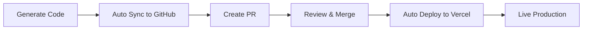
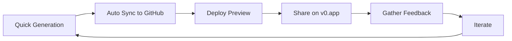
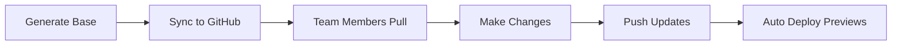

# 🔄 Auto Sync

Auto Sync is AiBuild's intelligent synchronization system that automatically manages code versioning, deployment, and integration with external platforms like GitHub, Vercel, and v0.app.

## Overview

Auto Sync provides seamless integration between your AI-generated projects and modern development workflows, enabling:

- **Automatic GitHub synchronization** - Push code to repositories with one click
- **Vercel deployment automation** - Deploy web applications instantly
- **v0.app integration** - Share and showcase your projects
- **Version control** - Automatic commit and branch management
- **Continuous synchronization** - Keep external platforms in sync with changes

## Features

### 1. GitHub Auto Sync

Automatically synchronize your projects with GitHub repositories.

#### Key Capabilities

**Repository Management:**
- Auto-create repositories for new projects
- Connect to existing repositories
- Automatic branch creation and management
- Smart commit message generation
- Pull request automation

**Synchronization Modes:**
- **Manual Sync** - Sync on-demand via UI
- **Auto Sync** - Automatic sync on save/generation
- **Scheduled Sync** - Periodic synchronization
- **Webhook-triggered** - Sync on external events

#### How It Works

```typescript
// Internal sync flow
async function syncToGitHub(projectId: string, options: SyncOptions) {
  // 1. Gather all project files
  const files = await fileService.getAllFiles(projectId)
  
  // 2. Create or update GitHub repository
  const repo = await githubClient.ensureRepository({
    name: project.slug,
    private: options.private,
  })
  
  // 3. Create branch (if needed)
  const branch = await githubClient.createBranch({
    repo,
    name: options.branch || `aibuild/${project.slug}`,
    from: options.baseBranch || 'main',
  })
  
  // 4. Commit files
  const commit = await githubClient.commitFiles({
    repo,
    branch,
    files,
    message: generateCommitMessage(project),
  })
  
  // 5. Create pull request (optional)
  if (options.createPR) {
    await githubClient.createPullRequest({
      repo,
      head: branch,
      base: options.baseBranch,
      title: `[AiBuild] ${project.name}`,
      body: generatePRDescription(project),
    })
  }
  
  // 6. Log sync event
  await traceLogger.log({
    kind: 'sync',
    status: 'ok',
    metadata: { repo, branch, commit },
  })
}
```

#### Configuration

Configure GitHub sync in your project settings:

```typescript
interface GitHubSyncConfig {
  enabled: boolean
  autoSync: boolean              // Sync on every save
  repository: string             // GitHub repo URL
  branch: string                 // Target branch
  createPR: boolean              // Auto-create pull requests
  commitMessageTemplate: string  // Custom commit messages
  syncTriggers: {
    onGenerate: boolean          // Sync after generation
    onSave: boolean              // Sync on file save
    onDeploy: boolean            // Sync before deploy
  }
}
```

#### Usage Examples

**Basic Sync:**
```typescript
// Via API
const result = await client.projects.syncToGitHub(projectId, {
  branch: 'feature/ai-generated',
  createPR: true,
})

// Via UI
// Click "Sync to GitHub" button in workspace
```

**Automatic Sync:**
```typescript
// Enable auto-sync in project settings
await client.projects.updateSettings(projectId, {
  github: {
    enabled: true,
    autoSync: true,
    syncTriggers: {
      onGenerate: true,
      onSave: true,
    },
  },
})
```

### 2. Vercel Auto Sync & Deploy

Seamlessly deploy web applications to Vercel with automatic configuration.

#### Key Capabilities

**Deployment Automation:**
- One-click deployment to Vercel
- Automatic project configuration
- Environment variable management
- Build settings optimization
- Domain configuration
- Preview deployments for branches

**Integration Features:**
- Link GitHub repository to Vercel
- Automatic deployment on push
- Preview URLs for every commit
- Production deployments on merge
- Rollback capabilities

#### How It Works

```typescript
async function deployToVercel(projectId: string) {
  const project = await projectService.get(projectId)
  
  // 1. Ensure GitHub sync is complete
  await syncToGitHub(projectId, { autoSync: true })
  
  // 2. Create or link Vercel project
  const vercelProject = await vercelClient.ensureProject({
    name: project.slug,
    framework: 'nextjs',
    rootDirectory: './',
  })
  
  // 3. Link GitHub repository
  await vercelClient.linkGitHub({
    projectId: vercelProject.id,
    repository: project.githubRepo,
    productionBranch: 'main',
  })
  
  // 4. Configure environment variables
  await vercelClient.setEnvironmentVariables({
    projectId: vercelProject.id,
    variables: project.envVars,
  })
  
  // 5. Trigger deployment
  const deployment = await vercelClient.deploy({
    projectId: vercelProject.id,
    target: 'production',
  })
  
  // 6. Store deployment record
  await deploymentService.create({
    projectId,
    provider: 'vercel',
    providerProjectId: vercelProject.id,
    artifactUrl: deployment.url,
    status: 'building',
  })
  
  return deployment
}
```

#### Configuration

```typescript
interface VercelSyncConfig {
  enabled: boolean
  autoDeployOnSync: boolean      // Deploy after GitHub sync
  projectId: string              // Vercel project ID
  team: string                   // Vercel team/org
  framework: string              // Next.js, React, etc.
  buildCommand: string           // Custom build command
  environmentVariables: {        // Environment variables
    [key: string]: string
  }
  domains: string[]              // Custom domains
}
```

#### Usage Examples

**Deploy to Vercel:**
```typescript
// Via API
const deployment = await client.projects.deployToVercel(projectId)

// Monitor deployment status
const status = await client.deployments.getStatus(deployment.id)

// Via UI
// Click "Deploy to Vercel" in workspace
```

**Auto-Deploy on Sync:**
```typescript
await client.projects.updateSettings(projectId, {
  vercel: {
    enabled: true,
    autoDeployOnSync: true,
  },
})
```

### 3. v0.app Integration

Share and showcase your AI-generated projects on v0.app.

#### Key Capabilities

**Project Sharing:**
- Export projects to v0.app format
- Generate shareable links
- Showcase in v0.app gallery
- Version management
- Fork and remix capabilities

**Sync Features:**
- Automatic format conversion
- Asset optimization
- Component extraction
- Preview generation

#### How It Works

```typescript
async function syncToV0App(projectId: string) {
  const project = await projectService.get(projectId)
  const files = await fileService.getAllFiles(projectId)
  
  // 1. Convert to v0.app format
  const v0Project = await convertToV0Format({
    name: project.name,
    description: project.prompt,
    files: files.map(f => ({
      path: f.path,
      content: f.content,
    })),
  })
  
  // 2. Generate preview
  const preview = await generatePreview(v0Project)
  
  // 3. Upload to v0.app
  const published = await v0Client.publish({
    project: v0Project,
    preview,
    visibility: 'public',
  })
  
  // 4. Store share link
  await projectService.update(projectId, {
    v0AppUrl: published.url,
  })
  
  return published
}
```

#### Configuration

```typescript
interface V0AppSyncConfig {
  enabled: boolean
  autoPublish: boolean           // Publish on generation
  visibility: 'public' | 'private'
  includeComponents: boolean     // Extract reusable components
  generatePreview: boolean       // Auto-generate preview
}
```

## Sync Workflows

### Workflow 1: Development to Production



### Workflow 2: Rapid Prototyping



### Workflow 3: Team Collaboration



## Sync Status Monitoring

Track synchronization status in real-time:

```typescript
interface SyncStatus {
  github: {
    connected: boolean
    lastSync: Date
    status: 'idle' | 'syncing' | 'error'
    repository: string
    branch: string
  }
  vercel: {
    connected: boolean
    lastDeploy: Date
    status: 'idle' | 'building' | 'deployed' | 'error'
    deploymentUrl: string
  }
  v0App: {
    connected: boolean
    published: boolean
    shareUrl: string
  }
}
```

## Conflict Resolution

Auto Sync includes intelligent conflict resolution:

### Strategies

1. **Auto-Merge** - Automatically merge non-conflicting changes
2. **Manual Review** - Prompt user for conflict resolution
3. **Overwrite** - Force push (with confirmation)
4. **Create Branch** - Sync to new branch to avoid conflicts

### Example

```typescript
async function handleSyncConflict(projectId: string, conflict: Conflict) {
  switch (conflict.strategy) {
    case 'auto-merge':
      return await autoMergeChanges(conflict)
    
    case 'manual':
      // Notify user and wait for resolution
      await notifyUser({
        type: 'sync-conflict',
        projectId,
        conflict,
      })
      return await waitForManualResolution(conflict)
    
    case 'create-branch':
      // Create new branch for changes
      return await syncToNewBranch(projectId, {
        branch: `aibuild/sync-${Date.now()}`,
      })
  }
}
```

## Security & Privacy

### Authentication
- **OAuth tokens** stored securely
- **Token refresh** automatic
- **Scoped permissions** minimal access
- **Token revocation** supported

### Data Protection
- **Encrypted credentials** in database
- **Audit logs** for all sync operations
- **Rate limiting** to prevent abuse
- **Privacy controls** for repository visibility

## Best Practices

### 1. Branch Strategy
```typescript
// Use descriptive branch names
const branch = `aibuild/${project.type}/${project.slug}`

// Or feature-based naming
const branch = `feature/${featureName}`
```

### 2. Commit Messages
```typescript
// Use semantic commits
const message = `feat: ${project.name} - Generated by AiBuild

Prompt: ${project.prompt}
Target: ${project.primaryTarget}
Generated: ${new Date().toISOString()}
`
```

### 3. Environment Variables
```typescript
// Never commit secrets
// Use Vercel environment variables
await vercelClient.setEnvironmentVariables({
  projectId,
  variables: {
    DATABASE_URL: { value: dbUrl, encrypted: true },
    API_KEY: { value: apiKey, encrypted: true },
  },
})
```

### 4. Deployment Verification
```typescript
// Always verify deployment before marking complete
async function verifyDeployment(deploymentUrl: string) {
  const response = await fetch(deploymentUrl)
  if (!response.ok) {
    throw new Error('Deployment verification failed')
  }
  return true
}
```

## Troubleshooting

### Common Issues

**GitHub Sync Fails:**
- Check OAuth token validity
- Verify repository permissions
- Ensure branch doesn't have conflicts
- Review GitHub API rate limits

**Vercel Deploy Fails:**
- Check build logs for errors
- Verify environment variables
- Ensure framework detection is correct
- Review Vercel project settings

**v0.app Upload Fails:**
- Verify project format compatibility
- Check file size limits
- Ensure all assets are included
- Review API quota

## API Reference

```typescript
// Sync to GitHub
POST /api/projects/:id/sync/github
Body: {
  branch?: string
  createPR?: boolean
  message?: string
}

// Deploy to Vercel
POST /api/projects/:id/deploy/vercel
Body: {
  target?: 'production' | 'preview'
  environment?: Record<string, string>
}

// Publish to v0.app
POST /api/projects/:id/publish/v0
Body: {
  visibility?: 'public' | 'private'
  includeComponents?: boolean
}

// Get sync status
GET /api/projects/:id/sync/status
```

## Learn More

- [Auto Test Documentation](./auto-test.md)
- [Auto Analysis Documentation](./auto-analysis.md)
- [Deployment Guide](../guides/deployment.md)
- [API Reference](../api/overview.md)

---

**Auto Sync makes deployment effortless - generate once, deploy everywhere.**
