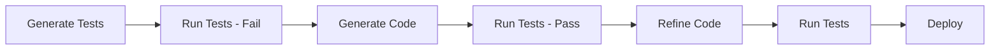
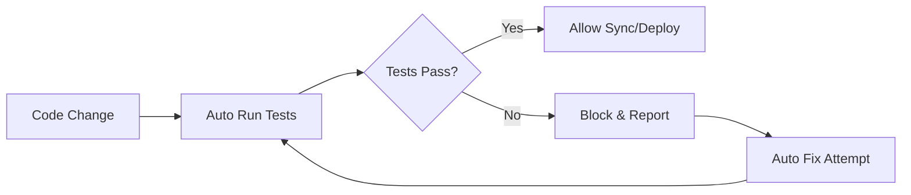

# 🧪 Auto Test

Auto Test is AiBuild's comprehensive automated testing system that continuously validates generated code, ensuring quality, reliability, and correctness throughout the development lifecycle.

## Overview

Auto Test provides intelligent, automated testing that:

- **Validates generated code** - Automatic test generation for AI-created projects
- **Continuous validation** - Run tests on every change
- **Multi-level testing** - Unit, integration, and end-to-end tests
- **Intelligent test generation** - AI-powered test creation
- **Real-time feedback** - Instant test results in the workspace
- **Regression prevention** - Detect breaking changes early

## Features

### 1. Automatic Test Generation

AiBuild automatically generates tests for your code based on project structure and functionality.

#### Test Types

**Unit Tests:**
- Component tests (React, Vue, etc.)
- Function tests
- Class method tests
- Utility function tests

**Integration Tests:**
- API endpoint tests
- Database interaction tests
- Service integration tests
- Component integration tests

**End-to-End Tests:**
- User flow tests
- Full application tests
- Cross-browser tests
- Mobile app tests

#### How It Works

```typescript
async function generateTests(projectId: string) {
  const project = await projectService.get(projectId)
  const files = await fileService.getAllFiles(projectId)
  
  // 1. Analyze code structure
  const analysis = await analyzer.analyzeProject({
    files,
    target: project.primaryTarget,
  })
  
  // 2. Identify testable components
  const testables = analysis.components
    .filter(c => c.isTestable)
    .map(c => ({
      path: c.path,
      type: c.type,
      exports: c.exports,
    }))
  
  // 3. Generate test files using AI
  const tests = await Promise.all(
    testables.map(async (testable) => {
      const testContent = await aiService.generateTest({
        component: testable,
        framework: project.testFramework || 'jest',
        style: 'comprehensive',
      })
      
      return {
        path: testable.path.replace(/\.(ts|js)x?$/, '.test$&'),
        content: testContent,
      }
    })
  )
  
  // 4. Save test files
  for (const test of tests) {
    await fileService.create(projectId, {
      path: test.path,
      content: test.content,
      language: 'typescript',
      generatedBy: 'ai',
    })
  }
  
  // 5. Log test generation
  await traceLogger.log({
    kind: 'test',
    status: 'ok',
    metadata: { testsGenerated: tests.length },
  })
  
  return tests
}
```

### 2. Continuous Testing

Tests run automatically on code changes to catch issues early.

#### Trigger Points

- **On Generation** - After AI generates/regenerates code
- **On Save** - When files are modified
- **On Sync** - Before GitHub sync
- **On Deploy** - Before deployment
- **Scheduled** - Periodic test runs

#### Configuration

```typescript
interface AutoTestConfig {
  enabled: boolean
  runOn: {
    generation: boolean
    save: boolean
    sync: boolean
    deploy: boolean
  }
  testFramework: 'jest' | 'vitest' | 'playwright'
  coverage: {
    enabled: boolean
    threshold: number  // Minimum coverage percentage
  }
  parallel: boolean   // Run tests in parallel
  timeout: number     // Test timeout in ms
}
```

### 3. Test Execution

Run tests with comprehensive reporting.

```typescript
async function runTests(projectId: string, options?: TestOptions) {
  // 1. Get test files
  const testFiles = await fileService.getTestFiles(projectId)
  
  if (testFiles.length === 0) {
    // Generate tests if none exist
    await generateTests(projectId)
    testFiles = await fileService.getTestFiles(projectId)
  }
  
  // 2. Set up test environment
  const testEnv = await setupTestEnvironment(projectId)
  
  // 3. Run tests
  const results = await testRunner.run({
    files: testFiles,
    parallel: options?.parallel ?? true,
    coverage: options?.coverage ?? false,
    timeout: options?.timeout ?? 30000,
  })
  
  // 4. Process results
  const summary = {
    total: results.length,
    passed: results.filter(r => r.status === 'passed').length,
    failed: results.filter(r => r.status === 'failed').length,
    skipped: results.filter(r => r.status === 'skipped').length,
    duration: results.reduce((sum, r) => sum + r.duration, 0),
    coverage: results.coverage,
  }
  
  // 5. Log results
  await traceLogger.log({
    kind: 'test',
    status: summary.failed > 0 ? 'error' : 'ok',
    metadata: summary,
  })
  
  // 6. Store results
  await testResultService.store({
    projectId,
    results,
    summary,
  })
  
  return { results, summary }
}
```

### 4. Test Analysis & Reporting

Comprehensive test result analysis and reporting.

#### Test Results Dashboard

```typescript
interface TestResult {
  id: string
  projectId: string
  testFile: string
  testName: string
  status: 'passed' | 'failed' | 'skipped'
  duration: number
  error?: {
    message: string
    stack: string
    expected?: string
    actual?: string
  }
  coverage?: {
    lines: number
    functions: number
    branches: number
    statements: number
  }
  createdAt: Date
}

interface TestSummary {
  total: number
  passed: number
  failed: number
  skipped: number
  duration: number
  coverage?: {
    lines: number
    functions: number
    branches: number
    statements: number
  }
  trend: {
    previous: TestSummary
    change: {
      passed: number
      failed: number
      coverage: number
    }
  }
}
```

### 5. Smart Test Suggestions

AI-powered suggestions for improving test coverage.

```typescript
async function suggestTests(projectId: string) {
  const project = await projectService.get(projectId)
  const coverage = await testResultService.getCoverage(projectId)
  
  // 1. Identify untested code
  const untestedFiles = coverage.files
    .filter(f => f.coverage < 80)
    .sort((a, b) => a.coverage - b.coverage)
  
  // 2. Analyze missing scenarios
  const suggestions = await Promise.all(
    untestedFiles.slice(0, 10).map(async (file) => {
      const analysis = await analyzer.analyzeFile(file.path)
      
      return {
        file: file.path,
        currentCoverage: file.coverage,
        missingTests: analysis.untestedPaths.map(path => ({
          scenario: path.scenario,
          priority: path.complexity > 3 ? 'high' : 'medium',
          suggestedTest: path.testTemplate,
        })),
      }
    })
  )
  
  return suggestions
}
```

## Test Frameworks

### Jest (Default for Web)

```typescript
// Auto-generated test example
import { render, screen } from '@testing-library/react'
import { UserProfile } from './user-profile'

describe('UserProfile', () => {
  it('renders user name correctly', () => {
    render(<UserProfile name="John Doe" />)
    expect(screen.getByText('John Doe')).toBeInTheDocument()
  })
  
  it('displays avatar when provided', () => {
    render(<UserProfile name="John" avatar="/avatar.jpg" />)
    const avatar = screen.getByRole('img')
    expect(avatar).toHaveAttribute('src', '/avatar.jpg')
  })
  
  it('handles missing avatar gracefully', () => {
    render(<UserProfile name="John" />)
    expect(screen.queryByRole('img')).not.toBeInTheDocument()
  })
})
```

### Vitest (Alternative)

```typescript
import { describe, it, expect } from 'vitest'
import { mount } from '@vue/test-utils'
import UserCard from './UserCard.vue'

describe('UserCard', () => {
  it('renders props correctly', () => {
    const wrapper = mount(UserCard, {
      props: {
        user: {
          name: 'Jane Doe',
          email: 'jane@example.com',
        },
      },
    })
    
    expect(wrapper.text()).toContain('Jane Doe')
    expect(wrapper.text()).toContain('jane@example.com')
  })
})
```

### Playwright (E2E Tests)

```typescript
import { test, expect } from '@playwright/test'

test.describe('User Dashboard', () => {
  test('user can create a new project', async ({ page }) => {
    await page.goto('/dashboard')
    
    // Click new project button
    await page.click('button:has-text("New Project")')
    
    // Fill in project details
    await page.fill('input[name="name"]', 'Test Project')
    await page.fill('textarea[name="prompt"]', 'Build a todo app')
    
    // Submit form
    await page.click('button[type="submit"]')
    
    // Verify project was created
    await expect(page).toHaveURL(/\/workspace\//)
    await expect(page.locator('h1')).toContainText('Test Project')
  })
})
```

## Test Coverage

### Coverage Tracking

```typescript
interface CoverageReport {
  projectId: string
  timestamp: Date
  overall: {
    lines: number
    functions: number
    branches: number
    statements: number
  }
  files: Array<{
    path: string
    lines: number
    functions: number
    branches: number
    statements: number
    uncoveredLines: number[]
  }>
  trend: {
    previous: number
    current: number
    change: number
  }
}
```

### Coverage Enforcement

```typescript
// Enforce minimum coverage before deployment
async function validateCoverage(projectId: string): Promise<boolean> {
  const config = await projectService.getTestConfig(projectId)
  const coverage = await testResultService.getCoverage(projectId)
  
  if (!config.coverage.enabled) {
    return true
  }
  
  const meetsThreshold = coverage.overall.lines >= config.coverage.threshold
  
  if (!meetsThreshold) {
    throw new Error(
      `Coverage ${coverage.overall.lines}% is below threshold ${config.coverage.threshold}%`
    )
  }
  
  return true
}
```

## Visual Regression Testing

Detect unintended UI changes automatically.

```typescript
async function visualRegressionTest(projectId: string) {
  const pages = await pageService.getAllPages(projectId)
  
  for (const page of pages) {
    // 1. Render current version
    const currentScreenshot = await renderPage(page)
    
    // 2. Get baseline screenshot
    const baseline = await getBaselineScreenshot(projectId, page.path)
    
    // 3. Compare images
    const diff = await compareImages(currentScreenshot, baseline)
    
    // 4. Report differences
    if (diff.percentage > 0.1) {  // More than 0.1% difference
      await testResultService.reportVisualDiff({
        projectId,
        page: page.path,
        difference: diff.percentage,
        diffImage: diff.image,
      })
    }
  }
}
```

## Performance Testing

Monitor performance metrics during tests.

```typescript
interface PerformanceMetrics {
  loadTime: number
  firstContentfulPaint: number
  largestContentfulPaint: number
  timeToInteractive: number
  bundleSize: number
  lighthouse: {
    performance: number
    accessibility: number
    bestPractices: number
    seo: number
  }
}

async function performanceTest(projectId: string) {
  const url = await getPreviewUrl(projectId)
  
  const metrics = await lighthouse(url, {
    onlyCategories: ['performance', 'accessibility', 'best-practices', 'seo'],
  })
  
  await testResultService.storePerformanceMetrics({
    projectId,
    metrics,
  })
  
  // Alert if performance degrades
  if (metrics.lighthouse.performance < 90) {
    await notifyService.alert({
      type: 'performance-degradation',
      projectId,
      metrics,
    })
  }
}
```

## Test Workflows

### Workflow 1: Test-Driven Development



### Workflow 2: Continuous Testing



## Integration with Auto Fix

Auto Test works seamlessly with Auto Fix to automatically resolve test failures.

```typescript
async function testWithAutoFix(projectId: string) {
  let attempts = 0
  const maxAttempts = 3
  
  while (attempts < maxAttempts) {
    // Run tests
    const results = await runTests(projectId)
    
    if (results.summary.failed === 0) {
      // All tests passed
      return results
    }
    
    // Attempt auto-fix
    const failures = results.results.filter(r => r.status === 'failed')
    const fixed = await autoFix.fixTestFailures(projectId, failures)
    
    if (!fixed) {
      // Cannot auto-fix, require manual intervention
      break
    }
    
    attempts++
  }
  
  // Tests still failing after auto-fix attempts
  throw new Error('Tests failing after auto-fix attempts')
}
```

## Test Monitoring Dashboard

Real-time test monitoring in the workspace:

```typescript
interface TestMonitor {
  status: 'idle' | 'running' | 'passed' | 'failed'
  summary: TestSummary
  recentRuns: TestResult[]
  coverage: CoverageReport
  trends: {
    passRate: number[]
    coverage: number[]
    duration: number[]
  }
}
```

## Best Practices

### 1. Write Testable Code

```typescript
// Good - Testable
export function calculateTotal(items: Item[]): number {
  return items.reduce((sum, item) => sum + item.price, 0)
}

// Bad - Hard to test
export function calculateAndDisplay(items: Item[]) {
  const total = items.reduce((sum, item) => sum + item.price, 0)
  document.getElementById('total')!.textContent = `$${total}`
}
```

### 2. Use Descriptive Test Names

```typescript
// Good
it('should display error message when email is invalid', () => {})

// Bad
it('test email', () => {})
```

### 3. Test Edge Cases

```typescript
describe('calculateDiscount', () => {
  it('handles zero amount', () => {
    expect(calculateDiscount(0, 0.1)).toBe(0)
  })
  
  it('handles negative amounts', () => {
    expect(() => calculateDiscount(-100, 0.1)).toThrow()
  })
  
  it('handles 100% discount', () => {
    expect(calculateDiscount(100, 1)).toBe(0)
  })
})
```

### 4. Keep Tests Independent

```typescript
// Good - Independent tests
describe('UserService', () => {
  beforeEach(() => {
    // Fresh state for each test
    userService = new UserService()
  })
  
  it('creates user', () => {
    const user = userService.create({ name: 'John' })
    expect(user.name).toBe('John')
  })
  
  it('deletes user', () => {
    const user = userService.create({ name: 'Jane' })
    userService.delete(user.id)
    expect(userService.find(user.id)).toBeNull()
  })
})
```

## Troubleshooting

### Common Issues

**Tests Not Running:**
- Verify test framework is installed
- Check test file naming conventions
- Ensure test configuration is correct
- Review test environment setup

**Flaky Tests:**
- Add proper wait conditions
- Use test data isolation
- Avoid timing-dependent assertions
- Mock external dependencies

**Low Coverage:**
- Generate additional tests with AI
- Review coverage reports
- Identify untested paths
- Add integration tests

## API Reference

```typescript
// Generate tests
POST /api/projects/:id/tests/generate
Body: {
  framework?: string
  coverage?: boolean
}

// Run tests
POST /api/projects/:id/tests/run
Body: {
  files?: string[]
  parallel?: boolean
  coverage?: boolean
}

// Get test results
GET /api/projects/:id/tests/results

// Get coverage report
GET /api/projects/:id/tests/coverage
```

## Learn More

- [Auto Analysis Documentation](./auto-analysis.md)
- [Auto Fix Documentation](./auto-fix.md)
- [User Guide - Testing](../guides/user-guide.md#testing)
- [Developer Guide - Testing](../guides/developer-guide.md#testing)

---

**Auto Test ensures your AI-generated code is reliable and production-ready.**
